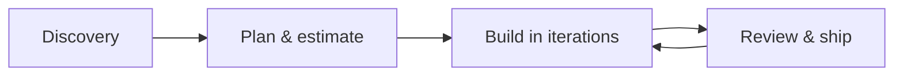

# Ruby & Rails Development

**Senior-level Ruby on Rails engineering** for teams that need reliable delivery, clear communication, and systems that scale with the business.

We design, build, and maintain web applications and APIs using modern Ruby and Rails practices—so you ship faster with less risk.

---

## Why Ruby on Rails (still) wins for product teams

Rails remains one of the fastest paths from idea to production: convention over configuration, a mature ecosystem, and a focus on developer productivity. That translates directly into **shorter time-to-market** and **lower total cost of ownership** when the work is done by someone who knows the stack deeply.

We help you leverage that strength without cutting corners on security, performance, or maintainability.

---

## What we deliver

| Area | How we help |
|------|-------------|
| **Greenfield products** | Architecture, domain modeling, APIs, admin tools, and a codebase your team can grow into |
| **Legacy rescue** | Upgrades (Ruby/Rails), performance tuning, test coverage, and refactors that reduce risk |
| **Integrations** | Payments, auth, webhooks, third-party APIs, background jobs (Sidekiq, etc.) |
| **DevOps & quality** | CI/CD, Docker, staging parity, monitoring hooks, and sensible deployment patterns |

---

## Tech stack we live in

- **Ruby** — idiomatic, maintainable code; performance where it matters  
- **Rails** — REST/JSON APIs, Hotwire, engines, multi-tenant patterns as needed  
- **Data** — PostgreSQL, Redis, solid query and caching strategy  
- **Async work** — Sidekiq, Active Job, reliable retries and observability  
- **Frontend** — ERB/Hotwire, Stimulus, or API backends for React/Vue/mobile clients  
- **Testing** — RSpec/Minitest, factories, integration tests that protect regressions  

*If your stack overlaps this list, we can plug in quickly. If you’re on something adjacent, we’ll align on the shortest path to value.*

---

## How we work with clients

1. **Discovery** — Goals, constraints, existing code or greenfield, timeline, and success criteria.  
2. **Plan** — Phased backlog, milestones, and transparent estimates.  
3. **Iterate** — Short cycles with demos, PRs you can review, and documentation where it helps.  
4. **Handoff** — Clean repo state, runbooks if needed, and knowledge transfer so your team owns the result.

Engagements can be **project-based**, **monthly retainer**, or **embedded** alongside your engineers—whatever fits your stage and budget.

---

## What clients get

- **Direct communication** — No mystery layers; you talk to the person doing the work.  
- **Production mindset** — Security, logging, errors, and deployability are part of the definition of done.  
- **Honest tradeoffs** — We’ll tell you when “quick” creates debt and when it doesn’t.  
- **Documentation that ages well** — READMEs, ADRs, or light inline notes where future readers need them.

---

## Ideal fit

You’ll get the most value if you:

- Need a **Rails expert** for a product or API that matters to revenue or operations  
- Want **upgrade or rescue** work done without stopping the world  
- Value **clear scope, steady velocity, and predictable collaboration**

---

## Get in touch

**Ready to discuss your Ruby or Rails project?**

- **Email:** [your.email@example.com](mailto:your.email@example.com)  
- **Calendar / booking:** [your booking link](https://example.com) *(optional)*  
- **Portfolio / case studies:** [your site or GitHub](https://github.com/yourusername) *(optional)*  

Replace the bracketed links above with your real contact details. For a stronger first impression, add 1–2 short anonymized case studies (problem → approach → outcome) in a `CASE_STUDIES.md` or on your site and link them here.

---

## License & repo note

This repository may hold discussion notes, samples, or collateral related to Ruby and Rails engagements. Unless otherwise stated, code and docs here are provided for evaluation and collaboration context—not as a substitute for a signed statement of work.

---

*Built with respect for the [Ruby](https://www.ruby-lang.org/) and [Rails](https://rubyonrails.org/) communities and the teams shipping real products on them.*
